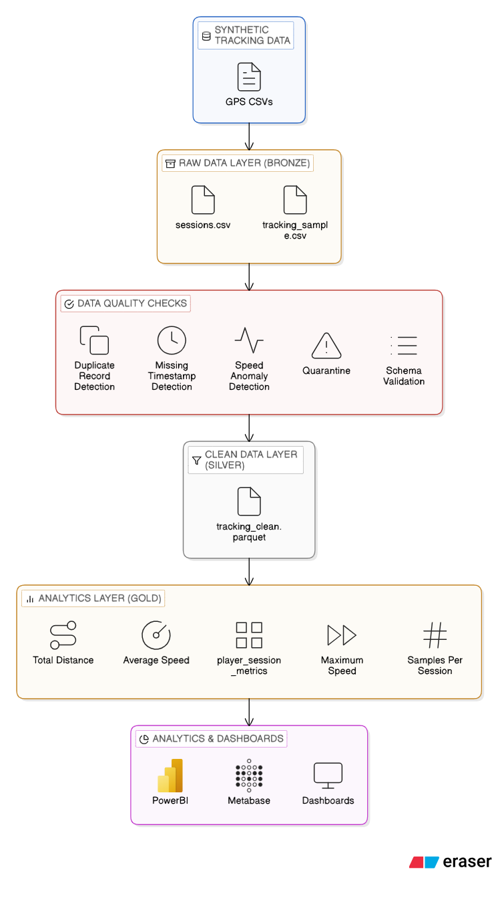

# Soccer Data Platform Demo


Live demo dashboard:

https://soccer-data-platform-demo-2ysoonreyzjsuspa2kf6ve.streamlit.app/

Example of an end-to-end data engineering pipeline for soccer tracking analytics.

This project simulates a production-style sports analytics data platform including data ingestion, validation, transformation, analytics modeling, and infrastructure examples.

The goal is to demonstrate modern data engineering practices such as reproducible pipelines, CI/CD automation, infrastructure-as-code, and workflow orchestration.

---

# Pipeline Architecture



The pipeline follows a modern **Bronze → Silver → Gold** data architecture.

| Layer | Description |
|------|-------------|
| Bronze | Raw GPS tracking data |
| Silver | Clean and validated tracking data stored in Parquet |
| Gold | Analytics-ready player metrics for dashboards |

---

# Dashboard

The project includes an interactive **Streamlit dashboard** to explore the analytics outputs.

The dashboard allows users to visualize:

- player movement trajectories on the field
- player distance covered
- speed distribution
- session performance metrics

Run locally:

```bash
streamlit run app.py
```

---

## Project Structure

```
soccer-data-platform-demo
│
├── src/ # pipeline scripts
│ ├── generate_sample_data.py
│ ├── validate.py
│ ├── transform.py
│ └── build_analytics.py
│
├── data/ # generated and processed datasets
│ ├── raw/
│ ├── processed/
│ └── analytics/
│
├── monitoring/ # data quality reports
├── airflow/ # example orchestration DAG
├── terraform/ # infrastructure-as-code example
├── architecture/ # pipeline architecture diagram
├── tests/ # automated pipeline tests (pytest)
├── config/ # configuration placeholders
│
├── app.py # Streamlit analytics dashboard
├── .github/workflows # CI/CD pipeline
├── Makefile # run full pipeline locally
├── requirements.txt # python dependencies
└── README.md
```

---

# Pipeline Stages

The pipeline simulates a typical sports tracking analytics workflow.

### 1️ Data Generation

Synthetic player tracking data is generated to simulate GPS data collected during soccer sessions.

```
python src/generate_sample_data.py
```

---

### 2️ Data Validation

Quality checks are applied to ensure reliability of the tracking data.

Validation checks include:

- duplicate record detection
- missing timestamp detection
- speed anomaly detection
- schema validation

Invalid records are moved to a quarantine dataset.

```
python src/validate.py
```

---

### 3️ Data Transformation

Validated tracking data is transformed into a structured dataset suitable for analytics.

```
python src/transform.py
```

The cleaned dataset is stored in **Parquet format** in the Silver layer.

---

### 4️. Analytics Layer

Player-level metrics are computed from the cleaned tracking data.

```
python src/build_analytics.py
```

Example metrics:

| player_id | session_id | total_distance_m | avg_speed | max_speed |
|-----------|-----------|-----------------|-----------|-----------|
| P001 | S001 | 10234 | 2.7 | 8.1 |

This table feeds the Streamlit dashboard for visualization.

Output location:

```
data/analytics/player_session_metrics.csv
```

---

## Running the Full Pipeline

The entire pipeline can be executed locally using the Makefile:

```bash
make pipeline
```

This runs:

1. synthetic data generation  
2. data validation  
3. data transformation  
4. analytics table creation

## Data Quality Monitoring

Data quality metrics are logged during the validation stage.

Example output:

```
monitoring/quality_report.json
```

The report includes:

- invalid record counts
- anomaly detection statistics
- validation results

This simulates basic **data observability practices**.

## CI/CD Pipeline

The repository includes a **GitHub Actions workflow** that automatically executes the pipeline on every commit.

Location:

```
.github/workflows/ci.yml
```

This demonstrates how a data pipeline can be continuously validated during development.

---

## Automated Testing

The project includes automated tests using **pytest** to validate pipeline components.

Tests cover:

- validation schema checks
- transformation outputs
- analytics table generation

Run tests locally:

```bash
pytest
```
These tests are automatically executed by the CI pipeline.

---

## Infrastructure as Code

This repository includes an example **Terraform configuration** to illustrate how the pipeline could be deployed in a cloud environment.

Location:

```
terraform/main.tf
```

The configuration provisions a simplified **data lake structure using Amazon S3**:

- raw data layer  
- processed data layer  
- analytics layer  

This infrastructure could support execution using:

- AWS Lambda or ECS for processing  
- Amazon EventBridge for event scheduling  
- Amazon Athena for querying analytics tables  
- BI tools such as Metabase or PowerBI for visualization  

---

## Pipeline Orchestration

In production environments this pipeline would typically be orchestrated using a workflow scheduler such as:

- Apache Airflow  
- Prefect  
- Dagster  

An example **Airflow DAG** is included in the repository:

```
airflow/soccer_pipeline_dag.py
```

The DAG defines tasks for each pipeline stage:

1. ingest_tracking_data  
2. validate_tracking_data  
3. transform_tracking_data  
4. build_player_metrics  
5. publish_analytics_tables  

The orchestration layer would manage:

- task execution order  
- retries and failure handling  
- scheduling  
- monitoring  

---

## Production Deployment Architecture

In a real production environment the pipeline could run as follows:

1. GPS tracking data is uploaded to a raw S3 bucket.  
2. EventBridge detects new files and triggers a processing job.  
3. A compute layer (Lambda or ECS) executes validation and transformations.  
4. Clean datasets are stored in the processed layer as Parquet files.  
5. Analytics tables are built for downstream consumption.  
6. BI tools such as Metabase or PowerBI query the data through Athena.  

This architecture follows the modern **Bronze → Silver → Gold data lake design pattern**.

---

## Dependencies

Minimal Python dependencies:

```
pandas
pyarrow
```

Additional tools such as **Airflow** or **Terraform** are included only as architectural examples.

---

## Purpose of the Project

This repository demonstrates:

- data pipeline design  
- data quality validation  
- analytics feature engineering  
- reproducible data workflows  
- CI/CD for data pipelines  
- infrastructure-as-code patterns  
- workflow orchestration design  

The project is intended as a **portfolio demonstration of modern data engineering practices applied to sports analytics**, including reproducible pipelines, data validation, CI/CD automation, and interactive analytics dashboards.


